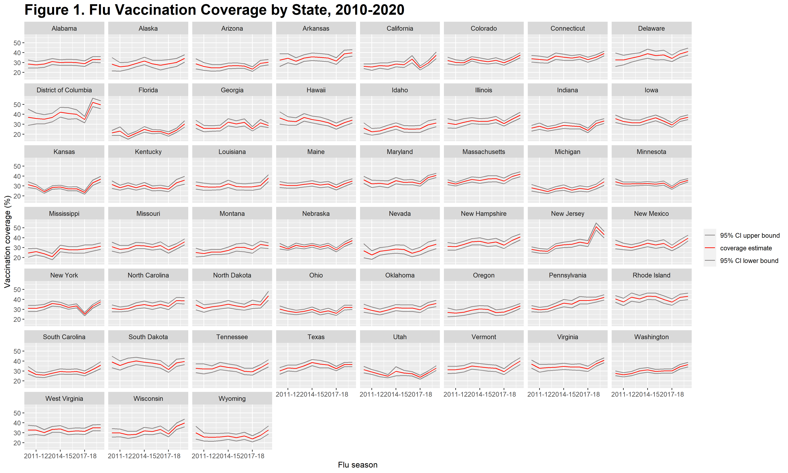
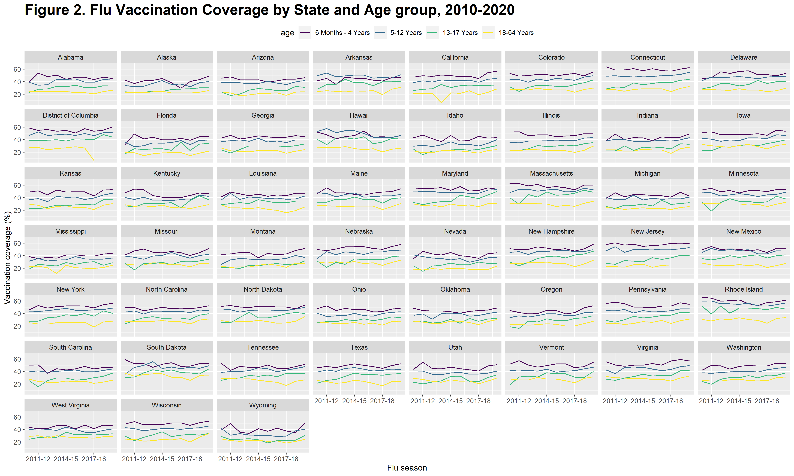
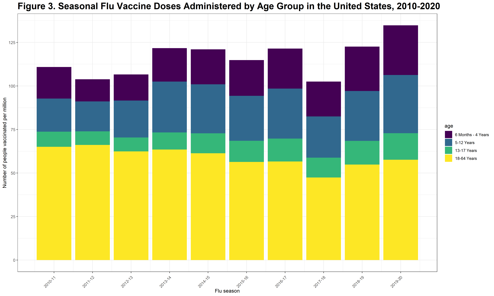

The structure below is a possible setup for a data analysis project (including the course project). For a manuscript, adjust as needed.


# Summary/Abstract
_Write a summary of your project._


# Introduction 

## General Background Information
_Provide enough background on your topic that others can understand the why and how of your analysis_ 

## Description of data and data source
_Describe what the data is, what it contains, where it is from, etc. Eventually this might be part of a methods section._

## Questions/Hypotheses to be addressed
_State the research questions you plan to answer with this analysis._


# Methods and Results
```{r figure1, echo=F}

```


```{r figure2, echo=F}

```


```{r figure3, echo=F}

```


## Full analysis

_Use one or several suitable statistical/machine learning methods to analyze your data and to produce meaningful figures, tables, etc. This might again be code that is best placed in one or several separate R scripts that need to be well documented. You want the code to produce figures and data ready for display as tables, and save those. Then you load them here._

# Discussion

## Summary and Interpretation
_Summarize what you did, what you found and what it means._

## Strengths and Limitations
_Discuss what you perceive as strengths and limitations of your analysis._

## Conclusions
_What are the main take-home messages?_

_Include citations in your Rmd file using bibtex, the list of references will automatically be placed at the end_

This paper [@Leek2015a] discusses types of analyses. 

Note that this cited reference will show up at the end of the document, the reference formatting is determined by the CSL file specified in the YAML header. Many more style files for almost any journal [are available](https://www.zotero.org/styles). You also specify the location of your bibtex reference file in the YAML. You can call your reference file anything you like, I just used the generic word `references.bib` but giving it a more descriptive name is probably better.


# References


